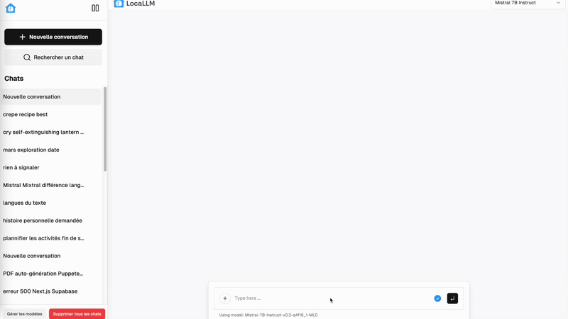

# LocaLLM

Un mini-ChatGPT qui fonctionne directement dans votre navigateur, sans cloud ni collecte de données.



## 🚀 **Essayez LocaLLM maintenant !**

<div align="center">

### [**🌐 Démo en ligne : chat.hugosoft.dev**](https://chat.hugosoft.dev)

*✨ Aucune installation requise - Testez immédiatement dans votre navigateur*

[](https://chat.hugosoft.dev)

</div>

---

## Fonctionnalités principales
- **🧠 Exécution locale** : Chargement local de LLM open source grâce à **WebLLM**
- **💬 Interface moderne** : Chat avec sélection du modèle et interface intuitive
- **⚡ Streaming en temps réel** : Réponses générées en streaming pour un rendu fluide
- **📝 Support Markdown** : Rendu complet du markdown avec **react-markdown** et **remark-gfm**
- **✏️ Édition de messages** : Possibilité de modifier et régénérer les messages utilisateur
- **💾 Historique persistant** : Sauvegarde automatique des conversations localement dans **IndexDB**
- **🔍 Recherche intelligente** : Recherche dans les titres et contenus des conversations

## Installation rapide
```bash
npm install
npm run dev
```
Ouvrez ensuite votre navigateur sur [http://localhost:3000](http://localhost:3000).

## 🎯 Tutoriel : Choisir votre modèle

### Première utilisation
1. **Ouvrez LocaLLM** dans votre navigateur
2. **La modal d'accueil s'affiche** automatiquement si aucun modèle n'est installé
3. **Choisissez votre modèle** dans la liste ci-dessous selon vos besoins
4. **Cliquez sur "Télécharger"** pour installer le modèle localement
5. **Attendez le téléchargement** (peut prendre quelques minutes selon votre connexion)

### Comparaison des modèles disponibles

| Modèle | Paramètres | Taille | Score | Recommandation | Utilisation idéale |
|--------|------------|--------|-------|----------------|-------------------|
| **Mistral 7B Instruct** | 7B | 4.8GB | A+ | **Recommandé** | Chat général, raisonnement, code |
| **Gemma 2 9B** | 9B | 5.0GB | A | PC puissant | Tâches complexes, analyse avancée |
| **Llama 3.2 3B** | 3B | 1.5GB | A+ | PC basique | Usage léger, réponses rapides |

### Guide de sélection selon votre PC

#### 💻 **PC basique (4-8GB RAM, Pas de GPU)**
- **Modèle recommandé :** Llama 3.2 3B
- **Avantages :** Très rapide, peu de mémoire, excellent pour l'usage quotidien
- **Limitations :** Réponses plus courtes, moins de nuance

#### 🖥️ **PC standard (8-16GB RAM, GPU récent)**
- **Modèle recommandé :** Mistral 7B Instruct
- **Avantages :** Excellent équilibre performance/qualité, très polyvalent
- **Utilisation :** Chat, code, analyse, rédaction

#### 🚀 **PC puissant (16GB+ RAM, GPU dédié)**
- **Modèle recommandé :** Gemma 2 9B
- **Avantages :** Qualité maximale, capacités avancées
- **Utilisation :** Tâches complexes, analyse approfondie, génération créative

### Conseils d'utilisation
- **Commencez par Mistral 7B** si vous hésitez - c'est le meilleur compromis
- **Testez plusieurs modèles** pour trouver celui qui vous convient
- **Les modèles restent installés** localement pour un accès rapide
- **Vous pouvez changer de modèle** à tout moment via le sélecteur en haut

## Technologies utilisées
- [Next.js](https://nextjs.org/) - Framework React full-stack
- [WebLLM](https://mlc.ai/web-llm/) - Exécution locale des LLMs
- [React](https://react.dev/) et [TypeScript](https://www.typescriptlang.org/) - Interface moderne
- [Tailwind CSS](https://tailwindcss.com/) - Styling utilitaire
- [React Markdown](https://github.com/remarkjs/react-markdown) - Rendu markdown
- [IndexDB](https://developer.mozilla.org/en-US/docs/Web/API/IndexedDB_API) - Stockage local
- [Zustand](https://zustand-demo.pmnd.rs/) - Gestion d'état
- [Radix UI](https://www.radix-ui.com/) - Composants accessibles

## À propos
Ce projet est fourni sous licence MIT. Il permet d'expérimenter facilement les modèles de langage directement sur sa machine, avec une expérience utilisateur moderne et complète.

## Docker
Pour lancer l'application dans un conteneur :
```bash
docker build -t locallm .
docker run -p 3000:3000 locallm
```
La configuration s'effectue via des variables d'environnement passées au conteneur.

## Docker Compose
Vous pouvez également démarrer le service via `docker compose` :
```bash
cp .env.example .env # créez vos variables d'environnement
docker compose up --build
```

## Contribution
Les contributions sont les bienvenues ! N'hésitez pas à ouvrir une issue ou une pull request.
